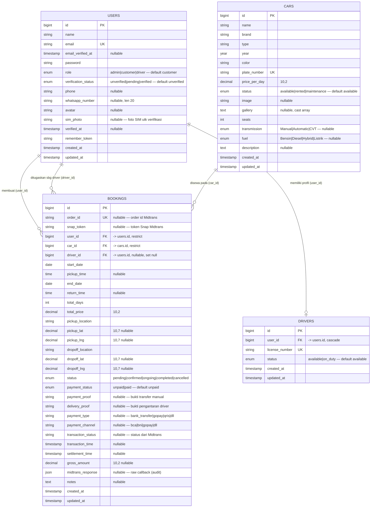

# Entity Relationship Diagram (ERD)

ERD menggambarkan entitas inti aplikasi Prasetya Rent Car beserta atribut dan relasinya.
Tabel pendukung framework (`sessions`, `password_reset_tokens`, `cache`, `jobs`) tidak
ditampilkan karena bukan bagian dari domain bisnis.

> Catatan penting: kolom `bookings.driver_id` mereferensikan **`users.id`** (bukan
> `drivers.id`), karena penugasan driver dilakukan terhadap akun User berperan `driver`.
> Profil `drivers` terhubung ke `users` melalui `drivers.user_id`.

> Domain terdiri dari **4 entitas** (User, Car, Driver, Booking). Entitas `Review` sudah
> dihapus (tabel `reviews` di-drop lewat migration).

## Keterangan Relasi

| Relasi | Kardinalitas | Foreign Key | On Delete |
|--------|--------------|-------------|-----------|
| User → Booking (pemesan) | 1 : N | `bookings.user_id` | **restrict** |
| User → Driver (profil) | 1 : 1 | `drivers.user_id` | cascade |
| User → Booking (sebagai driver) | 1 : N | `bookings.driver_id` | set null |
| Car → Booking | 1 : N | `bookings.car_id` | **restrict** |

> **Perubahan integritas:** FK `bookings.user_id` dan `bookings.car_id` diubah dari
> `cascade` menjadi **`restrict`** (migration `2026_06_22_120000`). Tujuannya melindungi
> jejak finansial/audit — user atau mobil yang masih punya riwayat booking tidak bisa
> dihapus, sehingga data historis tidak ikut terhapus. `driver_id` tetap `set null`.

## Catatan Kolom Pembayaran (Midtrans)

Kolom `order_id … midtrans_response` ditambahkan lewat migration
`2026_06_23_000000_add_midtrans_fields_to_bookings_table` untuk integrasi **Midtrans Snap**:

- `order_id` — unik, format `BOOKING-{id}-{timestamp}-{random}`, dibuat ulang tiap kali
  Snap token diminta (Midtrans tidak mengizinkan order_id ganda).
- `snap_token` — token untuk membuka halaman pembayaran Snap.
- `transaction_status` — status mentah dari Midtrans (`settlement`, `pending`, `expire`, dll).
- `midtrans_response` — JSON respons callback/notifikasi mentah untuk audit trail.
