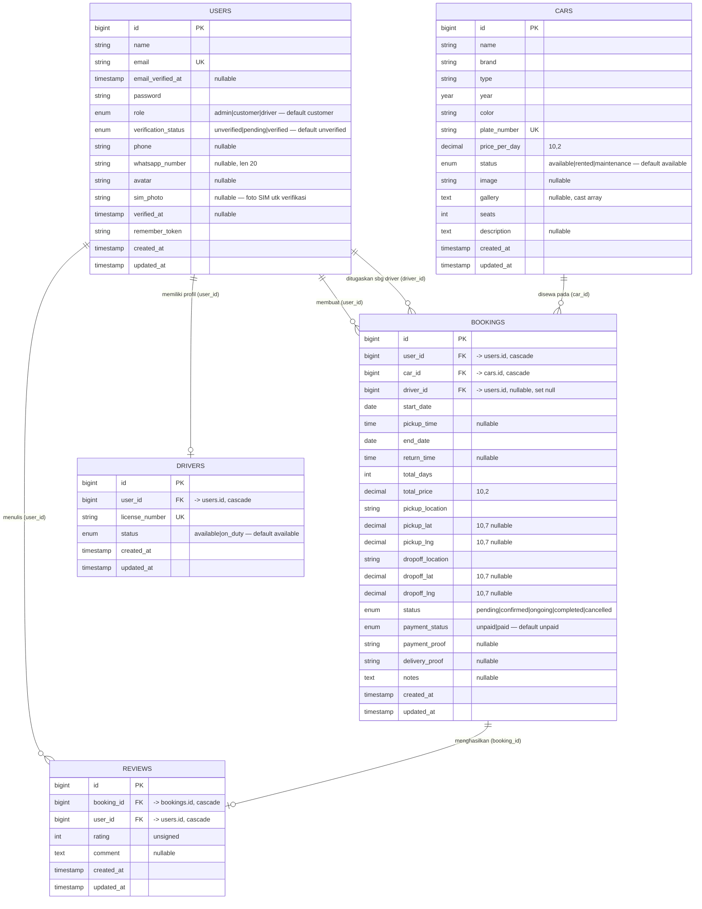

# Entity Relationship Diagram (ERD)

ERD menggambarkan entitas inti aplikasi Prasetya Rent Car beserta atribut dan relasinya.
Tabel pendukung framework (`sessions`, `password_reset_tokens`, `cache`, `jobs`) tidak
ditampilkan karena bukan bagian dari domain bisnis.

> Catatan penting: kolom `bookings.driver_id` mereferensikan **`users.id`** (bukan
> `drivers.id`), karena penugasan driver dilakukan terhadap akun User berperan `driver`.
> Profil `drivers` terhubung ke `users` melalui `drivers.user_id`.

## Keterangan Relasi

| Relasi | Kardinalitas | Foreign Key | On Delete |
|--------|--------------|-------------|-----------|
| User → Booking (pemesan) | 1 : N | `bookings.user_id` | cascade |
| User → Driver (profil) | 1 : 1 | `drivers.user_id` | cascade |
| User → Review | 1 : N | `reviews.user_id` | cascade |
| User → Booking (sebagai driver) | 1 : N | `bookings.driver_id` | set null |
| Car → Booking | 1 : N | `bookings.car_id` | cascade |
| Booking → Review | 1 : 1 | `reviews.booking_id` | cascade |
