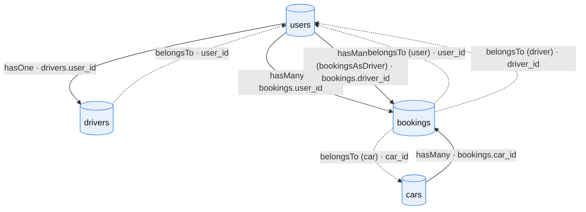
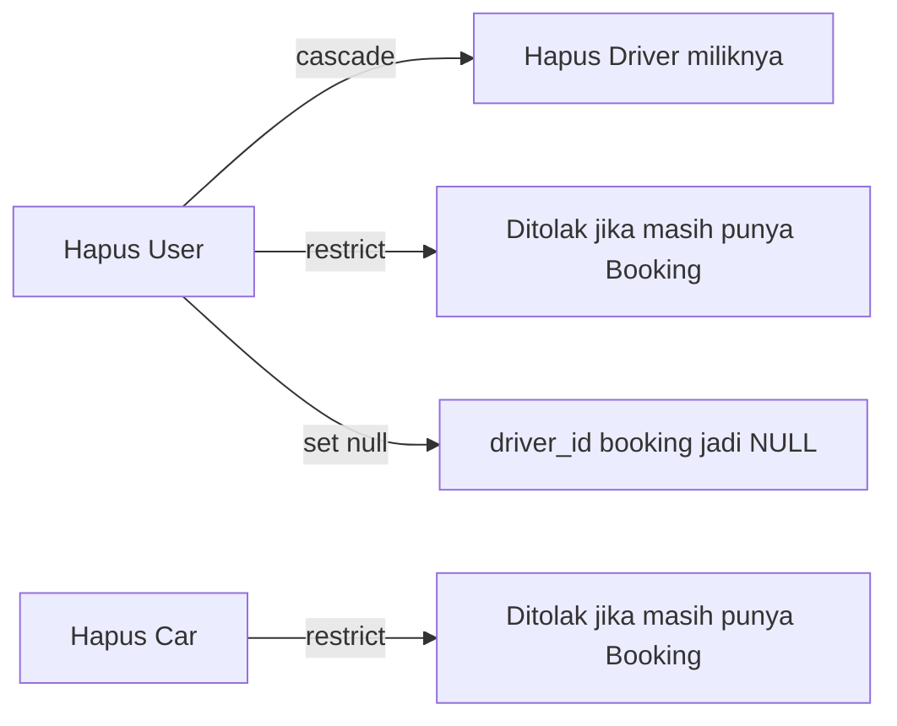

# Relasi Tabel

Dokumen ini memetakan relasi antar tabel sebagaimana didefinisikan pada migration
(foreign key) dan model Eloquent (relasi `hasMany`, `hasOne`, `belongsTo`).

## Diagram Relasi (Graph)

> Garis penuh = relasi "memiliki" (`hasMany` / `hasOne`).
> Garis putus-putus = relasi "milik" (`belongsTo`).

## Pemetaan Relasi Eloquent

### Model `User`
| Method | Tipe | Target | Foreign Key |
|--------|------|--------|-------------|
| `bookings()` | hasMany | Booking | `user_id` |
| `driver()` | hasOne | Driver | `user_id` |
| `bookingsAsDriver()` | hasMany | Booking | `driver_id` |

### Model `Car`
| Method | Tipe | Target | Foreign Key |
|--------|------|--------|-------------|
| `bookings()` | hasMany | Booking | `car_id` |
| `activeBooking()` | hasOne | Booking | `car_id` (status `ongoing`, `end_date` terbaru) |

### Model `Driver`
| Method | Tipe | Target | Key |
|--------|------|--------|-----|
| `user()` | belongsTo | User | `user_id` |
| `bookings()` | hasMany | Booking | `driver_id` → `user_id` |

### Model `Booking`
| Method | Tipe | Target | Foreign Key |
|--------|------|--------|-------------|
| `user()` | belongsTo | User | `user_id` |
| `car()` | belongsTo | Car | `car_id` |
| `driver()` | belongsTo | User | `driver_id` |

> Catatan: model `Review` dan relasinya (`User::reviews()`, `Booking::review()`) sudah
> **dihapus** seiring penghapusan fitur review.

## Aturan Integritas Referensial (On Delete)

> FK `bookings.user_id` & `bookings.car_id` menggunakan **RESTRICT**: user/mobil yang
> masih memiliki riwayat booking tidak dapat dihapus, melindungi data finansial & audit.
> `drivers.user_id` tetap **CASCADE**; `bookings.driver_id` tetap **SET NULL**.
