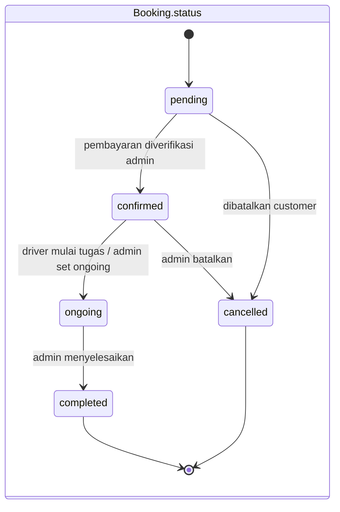
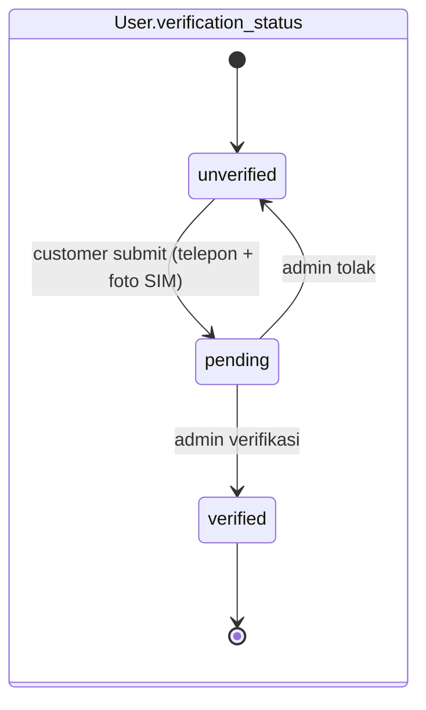
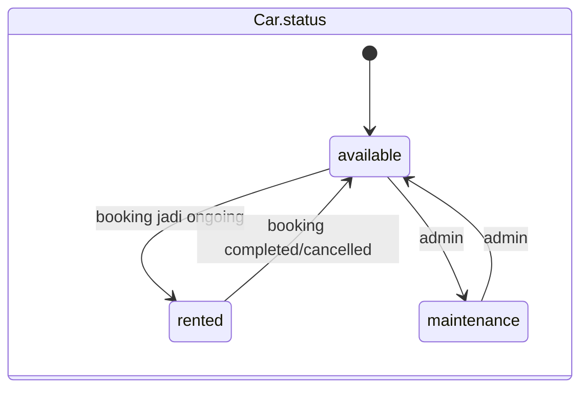

# Struktur Tabel

Struktur detail setiap tabel berdasarkan file migration. Tipe data, nullability,
nilai default, dan constraint diambil 100% sesuai definisi `Schema::create` /
`Schema::table`.

## Tabel `users`

| Kolom | Tipe | Null | Default | Keterangan |
|-------|------|------|---------|------------|
| id | bigint UNSIGNED | TIDAK | auto | Primary Key |
| name | varchar(255) | TIDAK | — | Nama lengkap |
| email | varchar(255) | TIDAK | — | **UNIQUE** |
| email_verified_at | timestamp | YA | NULL | — |
| password | varchar(255) | TIDAK | — | Hashed (cast `hashed`) |
| role | enum | TIDAK | `customer` | `admin` \| `customer` \| `driver` |
| verification_status | enum | TIDAK | `unverified` | `unverified` \| `pending` \| `verified` |
| phone | varchar(255) | YA | NULL | — |
| whatsapp_number | varchar(20) | YA | NULL | Ditambahkan via migration |
| avatar | varchar(255) | YA | NULL | Path foto profil |
| sim_photo | varchar(255) | YA | NULL | Path foto SIM (verifikasi) |
| verified_at | timestamp | YA | NULL | Waktu diverifikasi admin |
| remember_token | varchar(100) | YA | NULL | — |
| created_at / updated_at | timestamp | YA | NULL | — |

## Tabel `cars`

| Kolom | Tipe | Null | Default | Keterangan |
|-------|------|------|---------|------------|
| id | bigint UNSIGNED | TIDAK | auto | Primary Key |
| name | varchar(255) | TIDAK | — | Nama mobil |
| brand | varchar(255) | TIDAK | — | Merek |
| type | varchar(255) | TIDAK | — | Jenis (SUV, MPV, dll) |
| year | year | TIDAK | — | Tahun produksi |
| color | varchar(255) | TIDAK | — | Warna |
| plate_number | varchar(255) | TIDAK | — | **UNIQUE** — plat nomor |
| price_per_day | decimal(10,2) | TIDAK | — | Harga sewa/hari |
| status | enum | TIDAK | `available` | `available` \| `rented` \| `maintenance` |
| image | varchar(255) | YA | NULL | Foto utama |
| gallery | text | YA | NULL | JSON array (cast `array`) |
| seats | int | TIDAK | — | Jumlah kursi |
| description | text | YA | NULL | Deskripsi |
| created_at / updated_at | timestamp | YA | NULL | — |

## Tabel `drivers`

| Kolom | Tipe | Null | Default | Keterangan |
|-------|------|------|---------|------------|
| id | bigint UNSIGNED | TIDAK | auto | Primary Key |
| user_id | bigint UNSIGNED | TIDAK | — | **FK** → `users.id` (cascade) |
| license_number | varchar(255) | TIDAK | — | **UNIQUE** — nomor SIM |
| status | enum | TIDAK | `available` | `available` \| `on_duty` |
| created_at / updated_at | timestamp | YA | NULL | — |

## Tabel `bookings`

| Kolom | Tipe | Null | Default | Keterangan |
|-------|------|------|---------|------------|
| id | bigint UNSIGNED | TIDAK | auto | Primary Key |
| user_id | bigint UNSIGNED | TIDAK | — | **FK** → `users.id` (cascade) — pemesan |
| car_id | bigint UNSIGNED | TIDAK | — | **FK** → `cars.id` (cascade) |
| driver_id | bigint UNSIGNED | YA | NULL | **FK** → `users.id` (set null) — driver |
| start_date | date | TIDAK | — | Tanggal mulai sewa |
| pickup_time | time | YA | NULL | Jam penjemputan |
| end_date | date | TIDAK | — | Tanggal selesai sewa |
| return_time | time | YA | NULL | Jam pengembalian |
| total_days | int | TIDAK | — | Total hari (ceil jam/24) |
| total_price | decimal(10,2) | TIDAK | — | total_days × price_per_day |
| pickup_location | varchar(255) | TIDAK | — | Lokasi penjemputan |
| pickup_lat | decimal(10,7) | YA | NULL | Koordinat lat penjemputan |
| pickup_lng | decimal(10,7) | YA | NULL | Koordinat lng penjemputan |
| dropoff_location | varchar(255) | TIDAK | — | Lokasi pengantaran |
| dropoff_lat | decimal(10,7) | YA | NULL | Koordinat lat pengantaran |
| dropoff_lng | decimal(10,7) | YA | NULL | Koordinat lng pengantaran |
| status | enum | TIDAK | `pending` | `pending` \| `confirmed` \| `ongoing` \| `completed` \| `cancelled` |
| payment_status | enum | TIDAK | `unpaid` | `unpaid` \| `paid` |
| payment_proof | varchar(255) | YA | NULL | Bukti pembayaran |
| delivery_proof | varchar(255) | YA | NULL | Bukti pengantaran (oleh driver) |
| notes | text | YA | NULL | Catatan |
| created_at / updated_at | timestamp | YA | NULL | — |

## Tabel `reviews`

| Kolom | Tipe | Null | Default | Keterangan |
|-------|------|------|---------|------------|
| id | bigint UNSIGNED | TIDAK | auto | Primary Key |
| booking_id | bigint UNSIGNED | TIDAK | — | **FK** → `bookings.id` (cascade) |
| user_id | bigint UNSIGNED | TIDAK | — | **FK** → `users.id` (cascade) |
| rating | int UNSIGNED | TIDAK | — | Nilai rating |
| comment | text | YA | NULL | Komentar |
| created_at / updated_at | timestamp | YA | NULL | — |

## Tabel Pendukung Framework

| Tabel | Fungsi |
|-------|--------|
| `password_reset_tokens` | Token reset password (PK: `email`) |
| `sessions` | Penyimpanan session (`user_id`, `ip_address`, `payload`, dll) |
| `cache`, `cache_locks` | Cache database driver |
| `jobs`, `job_batches`, `failed_jobs` | Antrian (queue) |

## Diagram Status (State)

Perubahan nilai enum `status` yang dikelola sistem:

