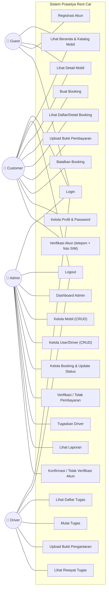
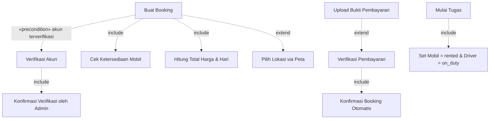

# Use Case Diagram

Use case dipetakan langsung dari definisi rute (`routes/web.php`) dan method controller.
Terdapat 4 aktor: **Guest** (belum login), **Customer**, **Admin**, dan **Driver**.

## Diagram Use Case Keseluruhan

## Relasi `<<include>>` & `<<extend>>`

> **Precondition penting:** Use case **Buat Booking (UC6)** hanya dapat dijalankan jika
> akun customer berstatus `verified`. Jika belum, sistem mengarahkan customer ke
> **Verifikasi Akun (UC22)** terlebih dahulu.

## Rincian Use Case per Aktor

### Guest (publik, tanpa login)
| Use Case | Rute | Controller |
|----------|------|-----------|
| Lihat beranda | `GET /` | closure (featured cars) |
| Katalog mobil | `GET /cars` | `Public\CarController@index` |
| Detail mobil | `GET /cars/{id}` | `Public\CarController@show` |
| Halaman about/contact | `GET /about`, `/contact` | closure |
| Registrasi | `GET/POST /register` | `Auth\AuthController@register` |
| Login | `GET/POST /login` | `Auth\AuthController@login` |

### Customer
| Use Case | Rute | Controller |
|----------|------|-----------|
| Dashboard | `GET /customer/dashboard` | `Customer\DashboardController@index` |
| Daftar booking | `GET /customer/bookings` | `Customer\BookingController@index` |
| Form booking | `GET /customer/bookings/create` | `Customer\BookingController@create` |
| Simpan booking | `POST /customer/bookings` | `Customer\BookingController@store` |
| Detail booking | `GET /customer/bookings/{id}` | `Customer\BookingController@show` |
| Upload bukti bayar | `POST /customer/bookings/{id}/upload-payment` | `Customer\BookingController@uploadPayment` |
| Batalkan booking | `POST /customer/bookings/{id}/cancel` | `Customer\BookingController@cancel` |
| Edit profil | `GET/PUT /customer/profile` | `Customer\ProfileController@edit/update` |
| Ganti password | `GET/PUT /customer/profile/password` | `Customer\ProfileController@editPassword/updatePassword` |
| Hapus avatar | `DELETE /customer/profile/avatar` | `Customer\ProfileController@deleteAvatar` |
| Ajukan verifikasi akun | `POST /customer/profile/verification` | `Customer\ProfileController@submitVerification` |

### Admin
| Use Case | Rute | Controller |
|----------|------|-----------|
| Dashboard | `GET /admin/dashboard` | `Admin\DashboardController@index` |
| CRUD mobil | `GET/POST/PUT/DELETE /admin/cars...` | `Admin\CarController` |
| Toggle status mobil | `POST /admin/cars/{id}/toggle-status` | `Admin\CarController@toggleStatus` |
| Daftar/detail booking | `GET /admin/bookings...` | `Admin\BookingController@index/show` |
| Update status booking | `POST /admin/bookings/{id}/update-status` | `Admin\BookingController@updateStatus` |
| Tugaskan driver | `POST /admin/bookings/{id}/assign-driver` | `Admin\BookingController@assignDriver` |
| Verifikasi pembayaran | `POST /admin/bookings/{id}/verify-payment` | `Admin\BookingController@verifyPayment` |
| Tolak pembayaran | `POST /admin/bookings/{id}/reject-payment` | `Admin\BookingController@rejectPayment` |
| CRUD user | `GET/POST/PUT/DELETE /admin/users...` | `Admin\UserController` |
| Verifikasi akun user | `POST /admin/users/{id}/verify` | `Admin\UserController@verifyUser` |
| Tolak verifikasi akun | `POST /admin/users/{id}/reject-verification` | `Admin\UserController@rejectVerification` |
| Laporan | `GET /admin/reports` | `Admin\ReportController@index` |

### Driver
| Use Case | Rute | Controller |
|----------|------|-----------|
| Dashboard | `GET /driver/dashboard` | `Driver\DashboardController@index` |
| Daftar tugas | `GET /driver/tasks` | `Driver\TaskController@index` |
| Riwayat tugas | `GET /driver/tasks/history` | `Driver\TaskController@history` |
| Detail tugas | `GET /driver/tasks/{id}` | `Driver\TaskController@show` |
| Mulai tugas | `POST /driver/tasks/{id}/start` | `Driver\TaskController@startTask` |
| Selesai (upload bukti) | `POST /driver/tasks/{id}/complete` | `Driver\TaskController@completeTask` |

> Otorisasi ditegakkan oleh `RoleMiddleware` (`role:admin`, `role:customer`, `role:driver`)
> pada masing-masing grup rute.
