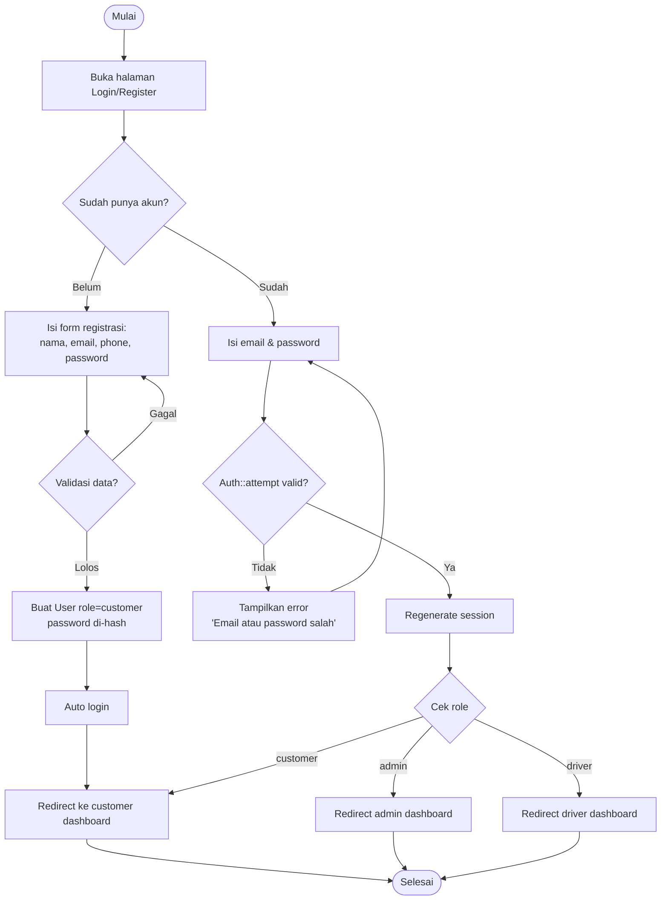
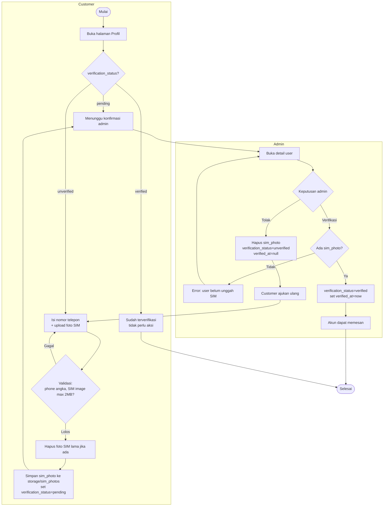
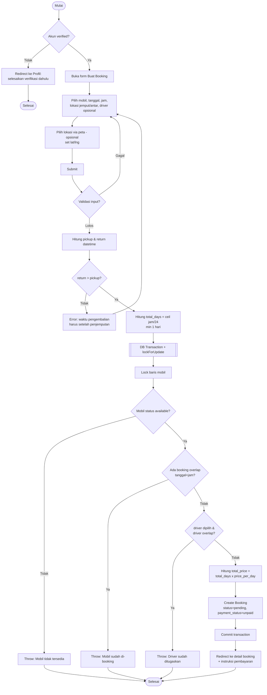
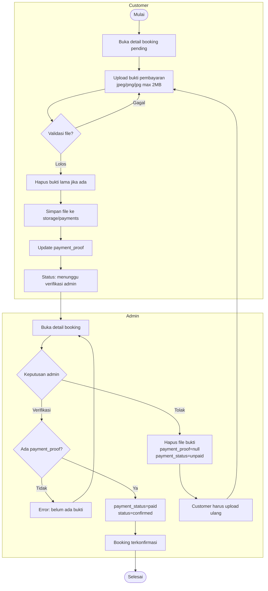
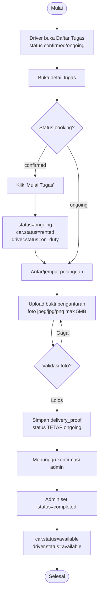
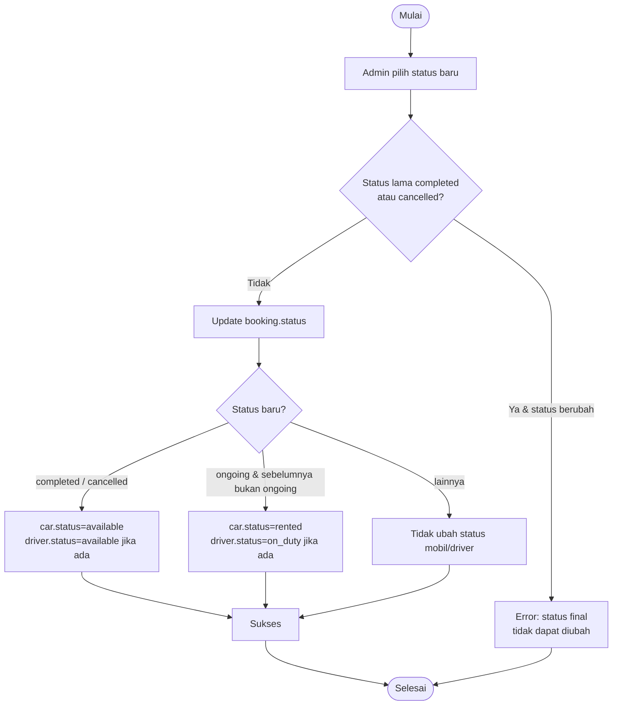

# Activity Diagram

Activity diagram menggambarkan alur kerja proses bisnis utama. Setiap diagram mengikuti
logika nyata pada controller terkait.

## 1. Registrasi & Login (Autentikasi)

## 2. Verifikasi Akun (Customer & Admin)

## 3. Membuat Booking (Customer)

## 4. Pembayaran & Verifikasi

## 5. Pelaksanaan Tugas (Driver)

## 6. Update Status Booking oleh Admin

