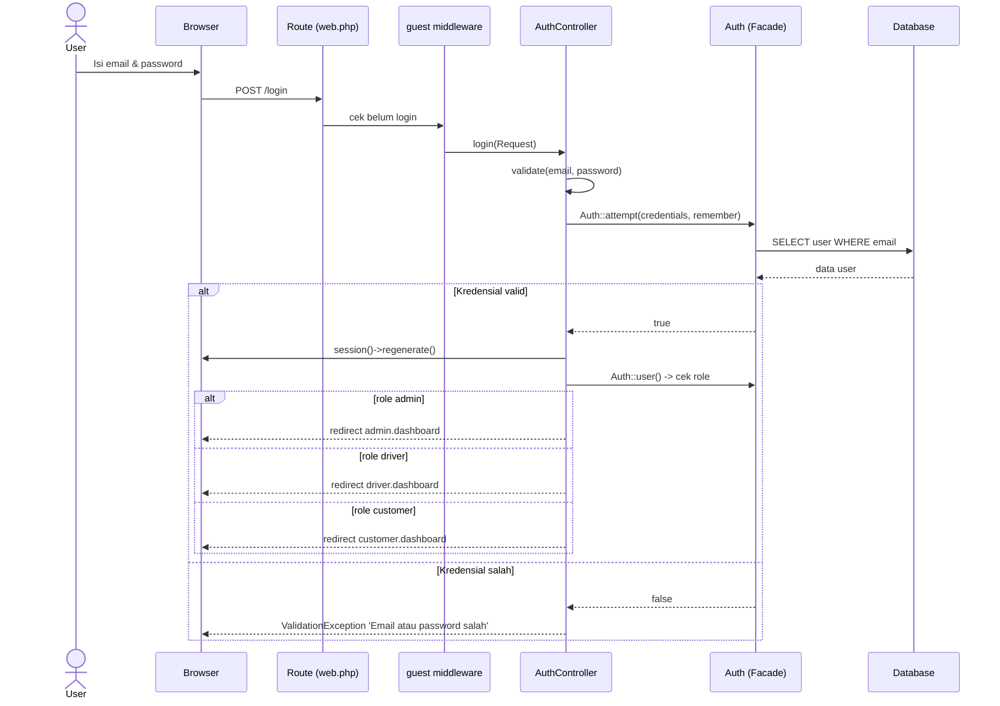
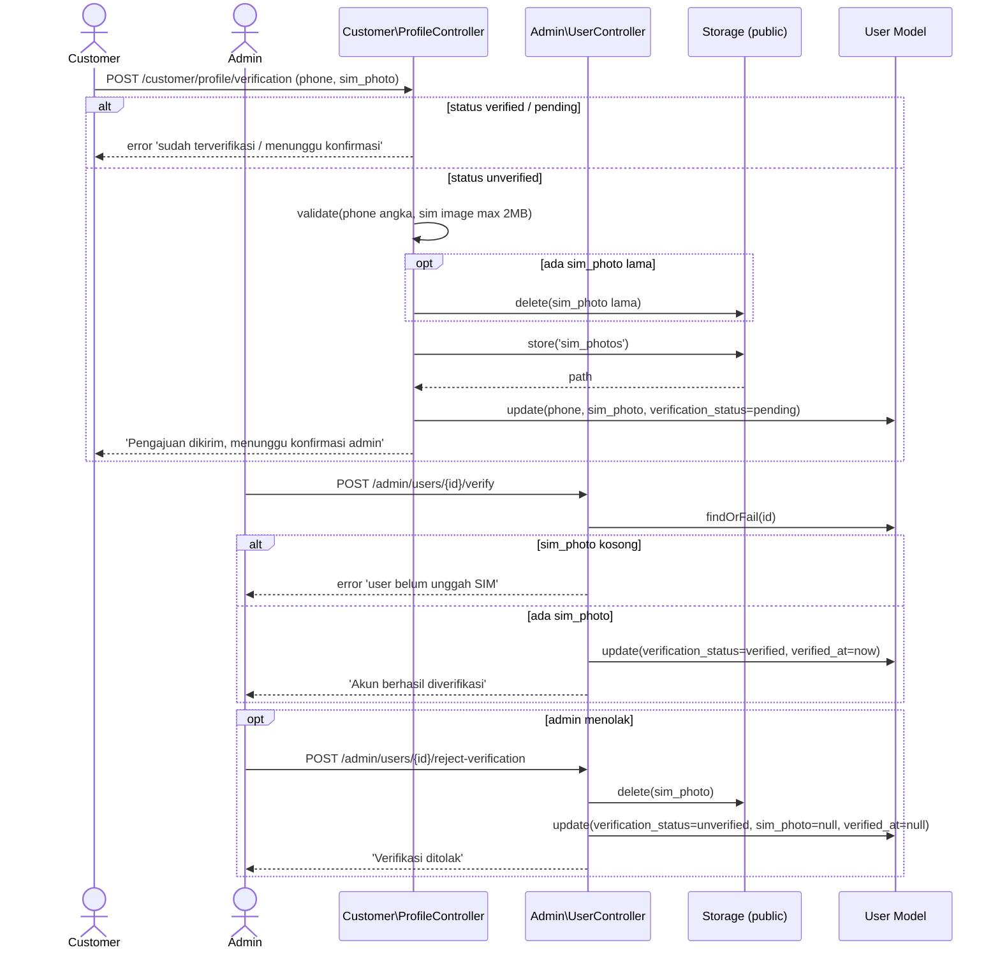
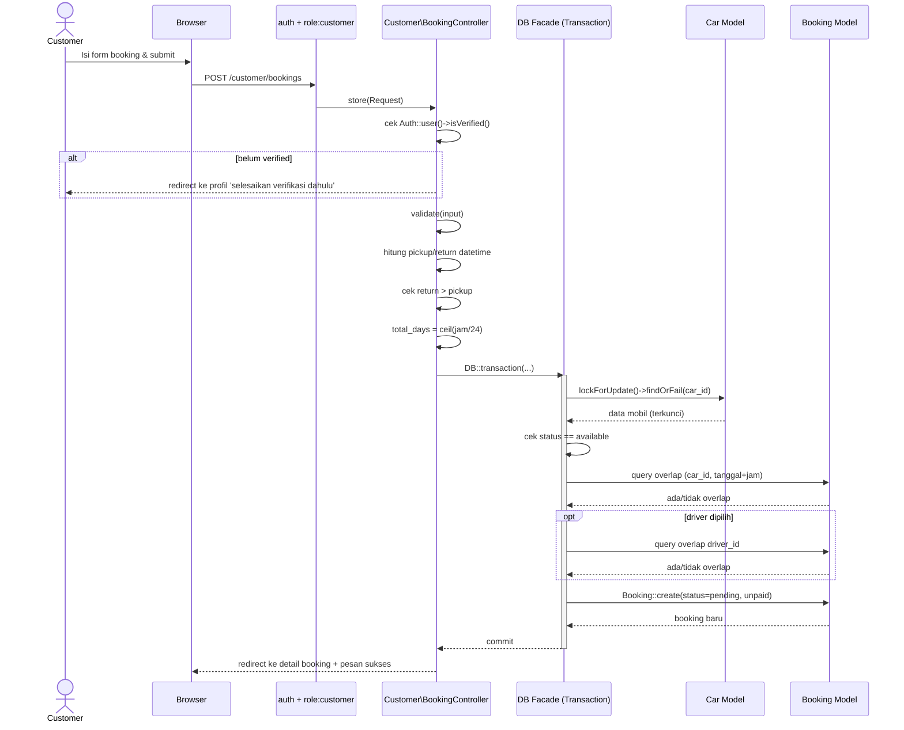
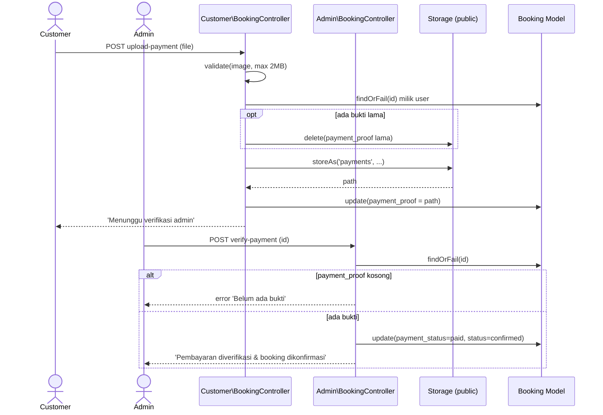
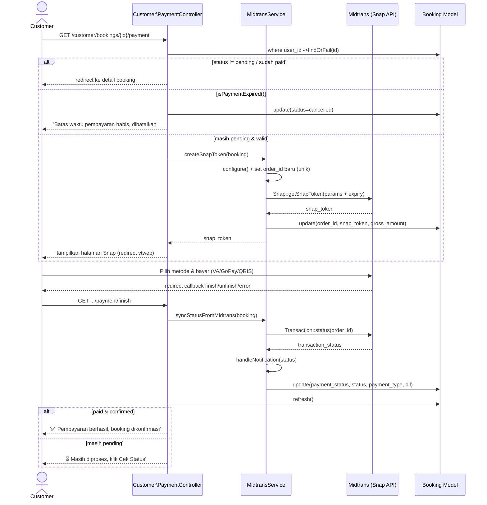
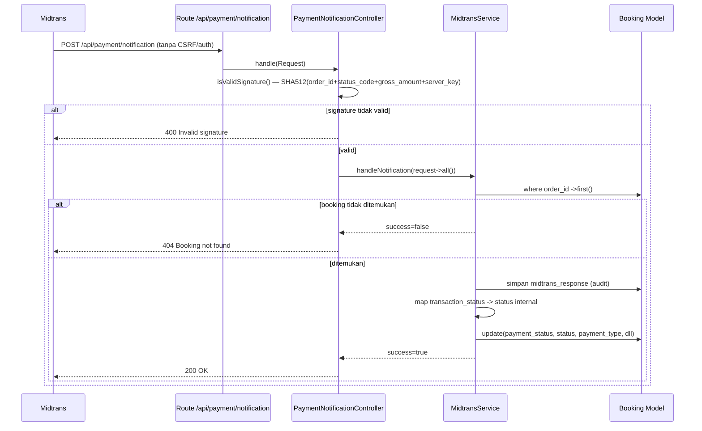
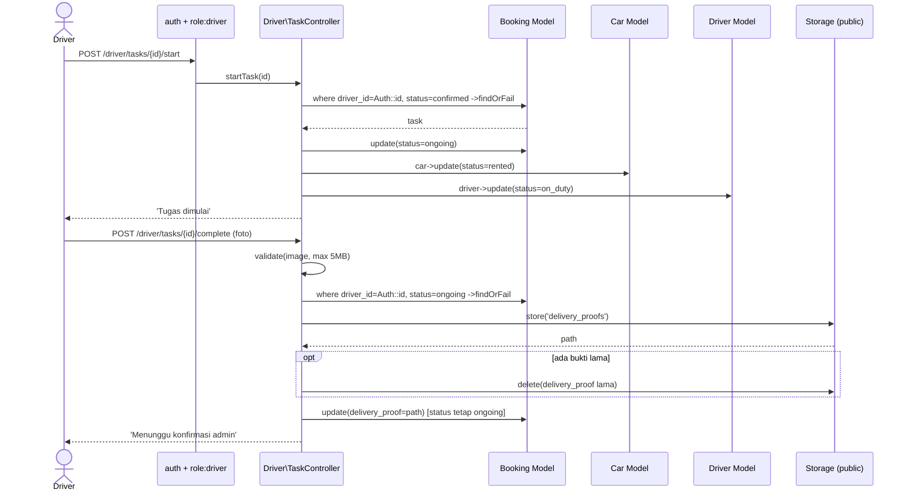
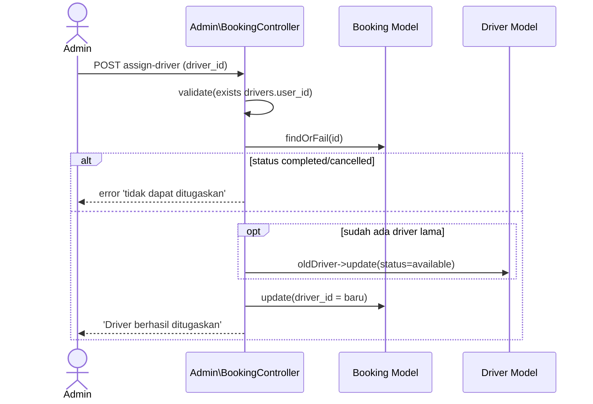
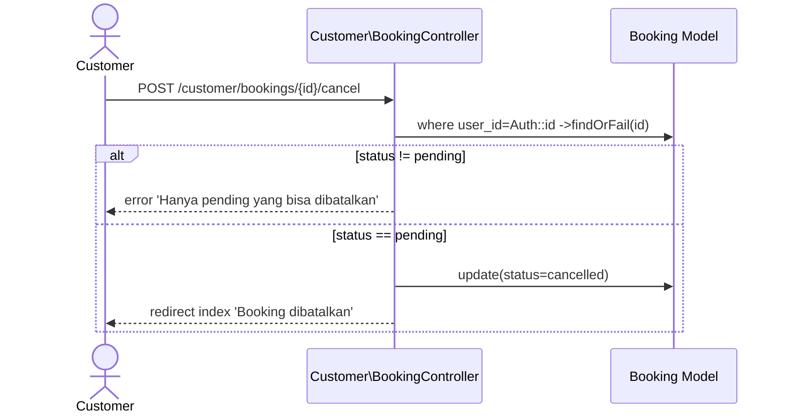

# Sequence Diagram

Sequence diagram menggambarkan interaksi antar objek (Aktor → Route/Middleware →
Controller → Model → Database → View) untuk skenario utama. Alur mengikuti implementasi
controller secara akurat.

## 1. Login

## 2. Verifikasi Akun (Customer Ajukan, Admin Konfirmasi)

## 3. Membuat Booking (dengan proteksi race condition)

## 4. Upload Bukti Bayar Manual & Verifikasi Admin

## 4b. Pembayaran Online via Midtrans Snap

## 4c. Webhook Notifikasi Midtrans (Server-to-Server)

> Mapping status Midtrans → internal: `settlement`/`capture(accept)` → `paid`+`confirmed`;
> `pending` → tetap `pending`; `expire`/`cancel`/`refund` → `cancelled`; `deny` → tetap `pending`.

## 5. Driver Mulai Tugas & Upload Bukti Pengantaran

## 6. Admin Tugaskan Driver

## 7. Customer Batalkan Booking

