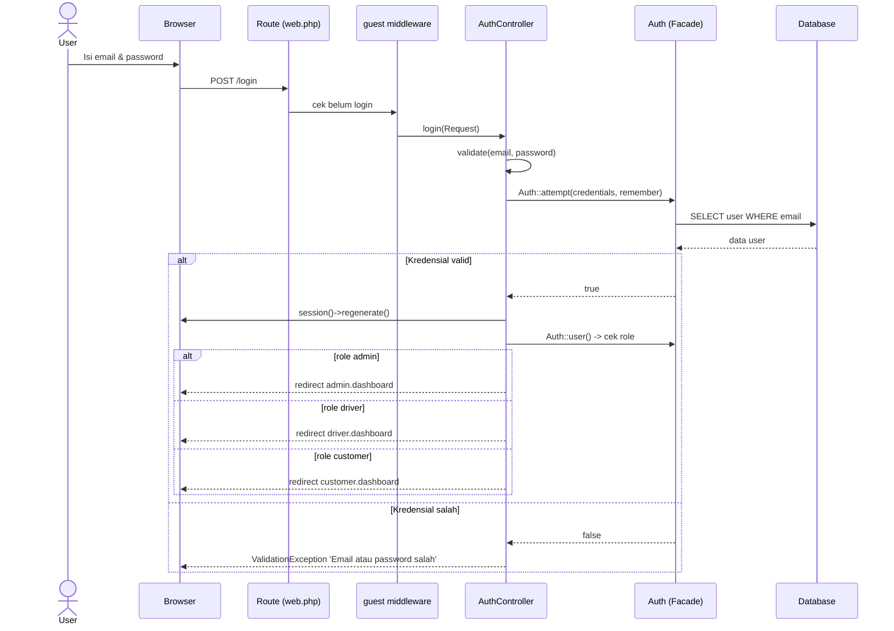
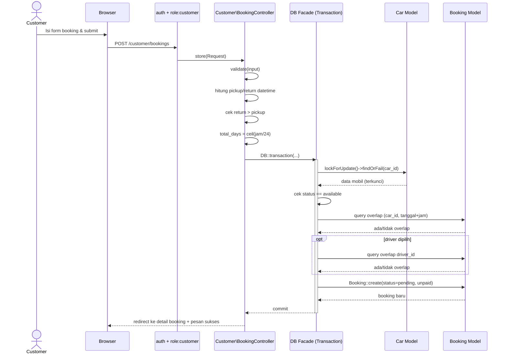
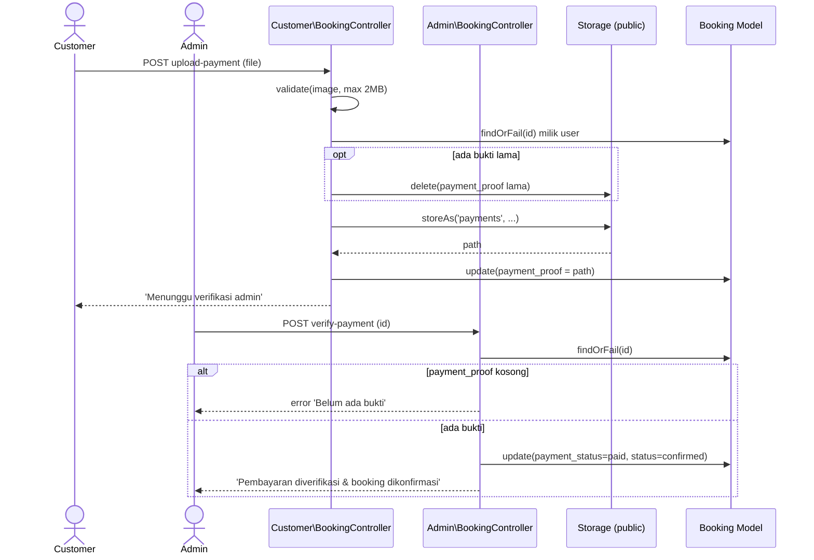
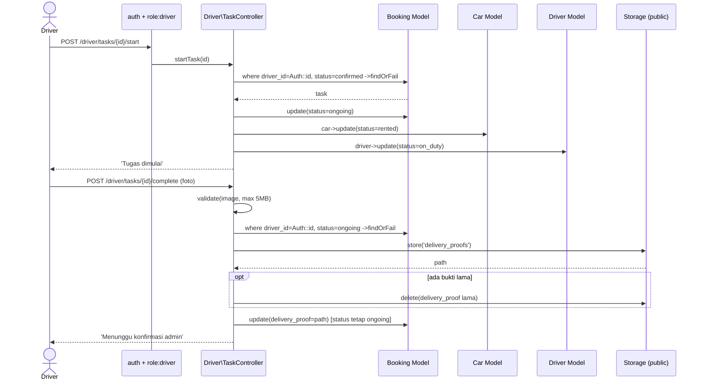
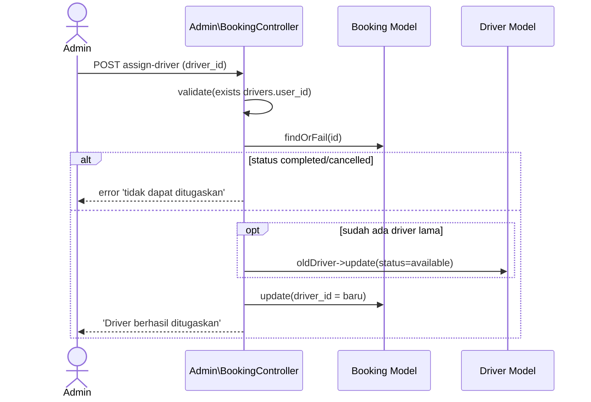
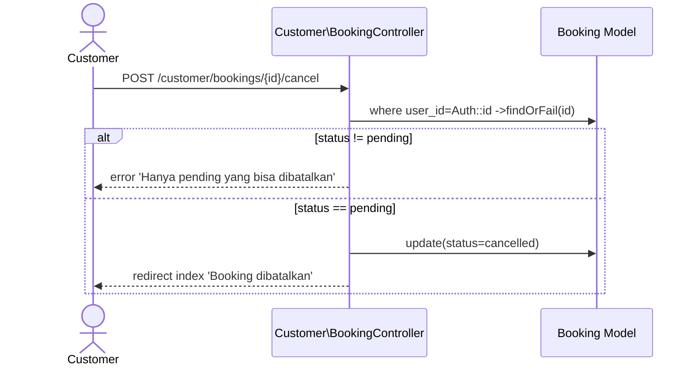

# Sequence Diagram

Sequence diagram menggambarkan interaksi antar objek (Aktor → Route/Middleware →
Controller → Model → Database → View) untuk skenario utama. Alur mengikuti implementasi
controller secara akurat.

## 1. Login

## 2. Membuat Booking (dengan proteksi race condition)

## 3. Upload Bukti Bayar & Verifikasi Admin

## 4. Driver Mulai Tugas & Upload Bukti Pengantaran

## 5. Admin Tugaskan Driver

## 6. Customer Batalkan Booking

