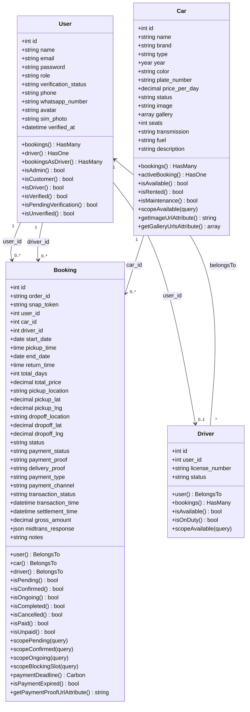
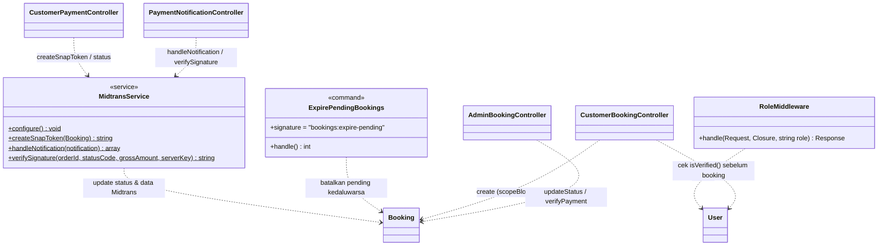

# Class Diagram

Class diagram menampilkan struktur kelas aplikasi: **Model Eloquent** (beserta atribut,
relasi, dan method bisnis), **Controller**, dan **Service**. Atribut dan method diambil
100% sesuai kode pada `app/Models`, `app/Http/Controllers`, dan `app/Services`.

## 1. Model (Domain)

> Fitur **Review** sudah dihapus — class `Review` beserta relasinya tidak lagi ada.

## 2. Controller

```mermaid
classDiagram
    class Controller {
        <<abstract>>
    }

    class AuthController {
        +showLoginForm()
        +login(Request)
        +showRegisterForm()
        +register(Request)
        +logout(Request)
        +showForgotPasswordForm()
        +sendResetLink(Request)
        +showResetForm(token)
        +resetPassword(Request)
    }

    class PublicCarController {
        +index(Request)
        +show(id)
    }

    class SecureFileController {
        +sim(id) StreamedResponse
        +payment(id) StreamedResponse
        +delivery(id) StreamedResponse
    }

    class AdminDashboardController {
        +index()
    }
    class AdminCarController {
        +index(Request)
        +create()
        +store(Request)
        +show(id)
        +edit(id)
        +update(Request, id)
        +destroy(id)
        +toggleStatus(id)
    }
    class AdminBookingController {
        +index(Request)
        +show(id)
        +updateStatus(Request, id)
        +assignDriver(Request, id)
        +verifyPayment(id)
        +rejectPayment(Request, id)
    }
    class AdminUserController {
        +index(Request)
        +create()
        +store(Request)
        +show(id)
        +edit(id)
        +update(Request, id)
        +destroy(id)
        +verifyUser(id)
        +rejectVerification(id)
    }
    class AdminReportController {
        +index()
    }

    class CustomerDashboardController {
        +index()
    }
    class CustomerBookingController {
        +index()
        +create(Request)
        +store(Request)
        +show(id)
        +uploadPayment(Request, id)
        +cancel(id)
    }
    class CustomerPaymentController {
        +show(bookingId)
        +regenerateToken(bookingId)
        +finish(Request, bookingId)
        +unfinish(Request, bookingId)
        +error(Request, bookingId)
        +checkStatus(bookingId)
    }
    class CustomerProfileController {
        +edit()
        +update(Request)
        +editPassword()
        +updatePassword(Request)
        +deleteAvatar()
        +submitVerification(Request)
    }

    class PaymentNotificationController {
        +handle(Request)
    }

    class DriverDashboardController {
        +index()
    }
    class DriverTaskController {
        +index()
        +history()
        +show(id)
        +startTask(id)
        +completeTask(Request, id)
    }

    Controller <|-- AuthController
    Controller <|-- PublicCarController
    Controller <|-- SecureFileController
    Controller <|-- AdminDashboardController
    Controller <|-- AdminCarController
    Controller <|-- AdminBookingController
    Controller <|-- AdminUserController
    Controller <|-- AdminReportController
    Controller <|-- CustomerDashboardController
    Controller <|-- CustomerBookingController
    Controller <|-- CustomerPaymentController
    Controller <|-- CustomerProfileController
    Controller <|-- PaymentNotificationController
    Controller <|-- DriverDashboardController
    Controller <|-- DriverTaskController
```

## 3. Service, Command & Ketergantungan

## Catatan Desain

- Aplikasi berjalan di atas **Laravel 12** (PHP 8.3).
- Model menggunakan atribut PHP `#[Fillable([...])]` / properti `$fillable` untuk mass-assignment.
  Pada `User`, field `role`, `verification_status`, dan `verified_at` **sengaja tidak**
  mass-assignable (cegah privilege-escalation / self-verify).
- `Car.gallery` (cast `array`), `Booking` tanggal/harga (`date`, `decimal:2`), dan
  `Booking.midtrans_response` (JSON) menggunakan **cast**.
- Otorisasi peran disentralisasi pada `RoleMiddleware` (alias `role`). Berkas PII
  (SIM, bukti bayar/antar) disajikan ber-otorisasi lewat `SecureFileController` dari disk privat.
- **Verifikasi akun**: `User.verification_status` `unverified` → `pending` → `verified`.
  Customer **wajib** `verified` (`isVerified()`) sebelum dapat membuat booking.
- **Pembayaran**: `MidtransService` membuat Snap token & memproses notifikasi/sinkronisasi.
  `Booking.paymentDeadline()` / `isPaymentExpired()` menghitung batas waktu bayar;
  `scopeBlockingSlot()` menentukan booking yang masih mengunci slot mobil/driver.
- **Auto-expire**: command `bookings:expire-pending` (dijadwalkan tiap menit pada
  `routes/console.php`) membatalkan booking pending yang melewati batas waktu pembayaran.
