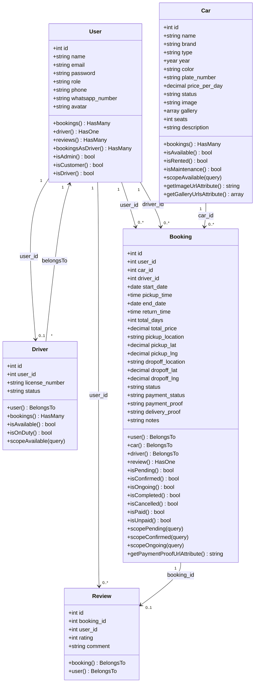
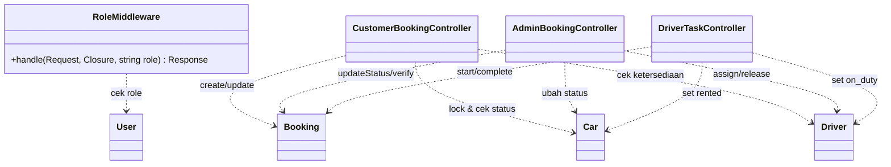

# Class Diagram

Class diagram menampilkan struktur kelas aplikasi: **Model Eloquent** (beserta atribut,
relasi, dan method bisnis) serta **Controller**. Atribut dan method diambil 100% sesuai
kode pada `app/Models` dan `app/Http/Controllers`.

## 1. Model (Domain)

## 2. Controller

```mermaid
classDiagram
    class Controller {
        <<abstract>>
    }

    class AuthController {
        +showLoginForm()
        +login(Request)
        +showRegisterForm()
        +register(Request)
        +logout(Request)
    }

    class PublicCarController {
        +index(Request)
        +show(id)
    }

    class AdminDashboardController {
        +index()
    }
    class AdminCarController {
        +index(Request)
        +create()
        +store(Request)
        +show(id)
        +edit(id)
        +update(Request, id)
        +destroy(id)
        +toggleStatus(id)
    }
    class AdminBookingController {
        +index(Request)
        +show(id)
        +updateStatus(Request, id)
        +assignDriver(Request, id)
        +verifyPayment(id)
        +rejectPayment(Request, id)
    }
    class AdminUserController {
        +index(Request)
        +create()
        +store(Request)
        +show(id)
        +edit(id)
        +update(Request, id)
        +destroy(id)
    }
    class AdminReportController {
        +index()
    }

    class CustomerDashboardController {
        +index()
    }
    class CustomerBookingController {
        +index()
        +create(Request)
        +store(Request)
        +show(id)
        +uploadPayment(Request, id)
        +cancel(id)
    }
    class CustomerProfileController {
        +edit()
        +update(Request)
        +editPassword()
        +updatePassword(Request)
        +deleteAvatar()
    }

    class DriverDashboardController {
        +index()
    }
    class DriverTaskController {
        +index()
        +history()
        +show(id)
        +startTask(id)
        +completeTask(Request, id)
    }

    Controller <|-- AuthController
    Controller <|-- PublicCarController
    Controller <|-- AdminDashboardController
    Controller <|-- AdminCarController
    Controller <|-- AdminBookingController
    Controller <|-- AdminUserController
    Controller <|-- AdminReportController
    Controller <|-- CustomerDashboardController
    Controller <|-- CustomerBookingController
    Controller <|-- CustomerProfileController
    Controller <|-- DriverDashboardController
    Controller <|-- DriverTaskController
```

## 3. Middleware & Ketergantungan Controller–Model

## Catatan Desain

- Semua model menggunakan atribut PHP `#[Fillable([...])]` (fitur Laravel 13) sebagai
  pengganti properti `$fillable`.
- `User` meng-extend `Authenticatable` dan menggunakan trait `HasFactory`, `Notifiable`.
- `Car.gallery` dan `Booking` tanggal/harga menggunakan **cast** (`array`, `date`, `decimal:2`).
- Otorisasi peran disentralisasi pada `RoleMiddleware` yang didaftarkan sebagai alias `role`.
- Password otomatis di-hash melalui cast `hashed` pada model `User`.
