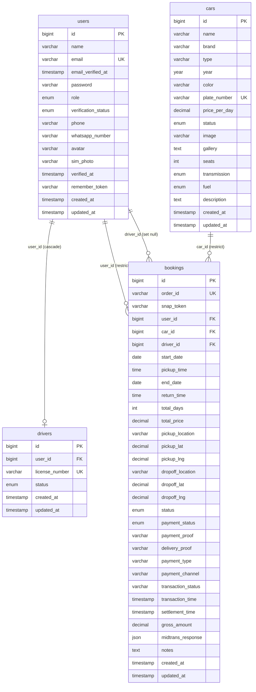

# Logical Record Structure (LRS)

LRS adalah hasil transformasi ERD ([08-transformasi-erd-lrs.md](08-transformasi-erd-lrs.md))
yang menampilkan setiap entitas sebagai **record** (kotak tabel) lengkap dengan field,
**primary key (PK)**, **foreign key (FK)**, serta garis penghubung antar record. Terdiri
dari **4 record**, tanpa tabel penghubung (tidak ada relasi M:N).

> Notasi: **PK** = primary key, **FK** = foreign key, **UK** = unique. Garis menghubungkan
> FK pada satu record ke PK record yang direferensikan, diberi keterangan aturan `ON DELETE`.

## Ringkasan Record & Kunci

| Record | Primary Key | Unique | Foreign Key | Merefensikan |
|--------|-------------|--------|-------------|--------------|
| **users** | `id` | `email` | — | — |
| **cars** | `id` | `plate_number` | — | — |
| **drivers** | `id` | `license_number` | `user_id` | `users.id` |
| **bookings** | `id` | `order_id` | `user_id`, `car_id`, `driver_id` | `users.id`, `cars.id`, `users.id` |

## Aturan Integritas Referensial

| Foreign Key | ON DELETE | Efek |
|-------------|-----------|------|
| `drivers.user_id` → `users.id` | CASCADE | Hapus user → profil driver ikut terhapus |
| `bookings.user_id` → `users.id` | **RESTRICT** | User yang masih punya booking tidak bisa dihapus |
| `bookings.driver_id` → `users.id` | SET NULL | Hapus user-driver → `driver_id` booking jadi NULL |
| `bookings.car_id` → `cars.id` | **RESTRICT** | Mobil yang masih punya booking tidak bisa dihapus |

> FK `bookings.user_id` & `bookings.car_id` memakai **RESTRICT** (bukan cascade) demi
> melindungi riwayat transaksi/finansial agar tidak ikut terhapus.

Spesifikasi field lengkap (tipe, panjang, null, default) terdapat pada
[10-spesifikasi-database.md](10-spesifikasi-database.md).
